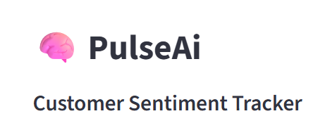
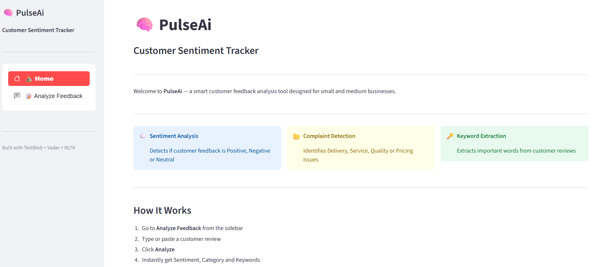

## PulseAi - Customer Sentiment Tracker App 😊😐😔😡

 

# Developed by Uzma, Tanni, Abida, Olid

 

# 1. Project Overview

## Introduction
**A sentiment analysis application built using Streamlit**
- Pulse AI is a web-based NLP (Natural Language Processing) application designed to help small and medium-sized businesses analyze customer feedback efficiently. Businesses receive customer reviews, comments, complaints, and ratings through platforms such as social media, delivery applications, websites, and messaging systems. Manually analyzing these reviews is time-consuming and inefficient.

** This system automatically analyzes customer reviews and identifies: **
- customer sentiment
- repeated complaints
- important keywords
- customer satisfaction trends

** The project applies NLP and machine learning techniques to transform customer feedback into useful business insights that support better decision-making. **

** The project structure and initial implementation are inspired by an existing Streamlit-based sentiment analysis application available on GitHub, which has been modified and customized to fit the business-focused objectives of this project. **

 

## Live Link
**Hosted on streamlit**

### 🔗 https://share.streamlit.io/gaganpreetkaurkalsi/sentimentanalysis-streamlit/main/app.py
 

## Problem Statement

Many small businesses struggle to:

* identify customer dissatisfaction quickly
* understand repeated service complaints
* analyze large amounts of customer feedback
* improve services using customer insights

Manual review analysis requires significant time and may lead to overlooked customer concerns.

 

## Proposed Solution

PulseAi provides an intelligent customer feedback analysis platform where businesses can enter customer reviews and instantly receive:

* sentiment classification
* issue categorization
* keyword extraction
* business insight summaries

The system helps businesses improve customer experience, service quality, and operational decisions using automated feedback analysis.

## Project Specifications

**Below are the libraries and frameworks used to create the project**
- **Web Framework** :- Streamlit
- **Graphs and Images** :- PIL, plotly, cv2
- **Libraries for sentiment analysis** :- textblob, nltk(vader), flair, text2emotion, fer
- **Libraries for API requests** :- requests, json

 

# 2. Objectives

The objectives of this project are:

* To automate customer review analysis
* To help businesses identify customer satisfaction levels
* To detect common customer complaints
* To provide a user-friendly web interface
* To demonstrate the practical use of NLP in solving business problems
* To provide quick insights from customer feedback data

 

# 3. Technologies Used

- Programming Language:Python

- Web Framework:Streamlit

- NLP Libraries: NLTK, TextBlob, spaCy

- Machine Learning:scikit-learn

- Data Processing: Pandas

- API Integration: Grok API (planned integration)

- Visualization: Plotly

- Model Storage: Pickle (.pkl)

- Dataset Source:Kaggle Customer Review Dataset

- Version Control: Git and GitHub

 

# 4. Functional Requirements

The system shall:

1. Allow users to input customer reviews manually
2. Analyze review sentiment automatically
3. Display sentiment results as Positive, Negative, or Neutral
4. Identify customer complaint categories
5. Extract important keywords from reviews
6. Display results in an interactive Streamlit interface
7. Process multiple reviews sequentially
8. Provide fast analysis responses
9. Allow future integration of AI-based recommendations using Grok API

 

# 5. Non-Functional Requirements

- Performance:The system should generate results within a few seconds.

- Usability:The application interface should be simple and user-friendly.

- Reliability:The application should provide consistent predictions.

- Maintainability:The codebase should allow easy modification and future upgrades.

- Scalability: Future support for dashboards and CSV uploads should be possible.

- Accessibility: The system should run in modern web browsers.

- Availability: The application can be deployed online using Streamlit Cloud.

 

# 6. System Features

## 6.1 Sentiment Analysis

The system determines customer sentiment as:

* Positive
* Negative
* Neutral

This helps businesses understand overall customer satisfaction levels.

 

## 6.2 Complaint Categorization

The system identifies major business-related complaint categories such as:

* Delivery Issues
* Customer Service Issues
* Product Quality Issues
* Pricing Issues

This helps businesses identify operational weaknesses.

 

## 6.3 Keyword Extraction

Important keywords are extracted from customer reviews to highlight repeated concerns and praised features.

Example:

Input:

> “The food quality was excellent but delivery was very slow.”

Output Keywords:

* food quality
* delivery
* slow

 

## 6.4 Interactive Streamlit Interface

The application provides:

* responsive UI
* text input sections
* prediction buttons
* result displays
* business-friendly interface

 

## 6.5 Future AI Recommendation Feature

Using Grok API integration, future versions may provide:

* automatic business improvement suggestions
* AI-generated summaries
* smart response recommendations

 

# 7. Workflow & Guide

### Step 1: Launch the Application

Run the Streamlit application using:

streamlit run app.py

### Step 2: Open the Web Interface

The application opens automatically in the browser window.

### Step 3: Enter Customer Feedback

Type or paste customer review text into the input field.

Example:

> “Delivery was delayed but the product quality was very good.”

---

### Step 4: Click “Analyze Review”

Press the analysis button to process the review: 
  - The system preprocesses the text.
  - NLP models analyze the review.
  - The system predicts sentiment and complaint category.
  - Important keywords are extracted.

---

### Step 5: View Results

** The system displays: **
- sentiment result
- complaint category
- extracted keywords

** Example Output: **
- Sentiment: Neutral
- Complaint Category: Delivery Issue
- Keywords: delivery, delayed, quality

  

# 8. Conclusion

BusinessPulse AI demonstrates how Natural Language Processing can help solve real business problems through automated customer feedback analysis. The project helps businesses save time, identify service-related issues faster, and improve customer satisfaction using data-driven insights.

The system combines machine learning, NLP, and Streamlit web technologies into a practical business-oriented application.

# Reference: 
- https://github.com/GaganpreetKaurKalsi/SentimentAnalysis-Streamlit

# Important information

## Models used
There are multiple libraries available in python for sentiment analysis. Let's see them below 👇

- **TextBlob** - TextBlob is a Python library for processing textual data. It provides a simple API for diving into common (NLP) tasks such as part-of-speech tagging, noun phrase extraction, sentiment analysis, classification, translation, and more.
- **Flair** - A very simple framework for state-of-the-art NLP. It is a powerful NLP library which allows you to apply state-of-the-art natural language processing (NLP) models to your text, such as named entity recognition (NER), part-of-speech tagging (PoS), etc.
- **Vader** - VADER (Valence Aware Dictionary and Sentiment Reasoner) is a lexicon and rule-based sentiment analysis tool that is specifically attuned to sentiments expressed in social media. 
- **text2emotion** - text2emotion is the python package which will help you to extract the emotions from the content. It processes any textual message and recognize the emotions embedded in it. It is compatible with 5 different emotion categories as Happy, Angry, Sad, Surprise and Fear.

 

*__Note :-__* 
1. textblob, flair and vader provide polarity score where text is declared in either of 3 states (POSITIVE🙂, NEGATIVE☹️, NEUTRAL😐)
2. text2emotion is the only library among the others mentioned above which can classify text in 5 emotion categories (HAPPY😊, ANGRY😡, SAD😔, SURPRISE😲, FEAR😨)

 

## Project development ideas

**Below mentioned applications can be implemented as a future scope -**
- Tweets analysis using Twitter API
- Sentiment analysis on Live video streaming
- Sentiment analysis of Audio data
- Sentiment analysis of data received from site given by user using web scraping in python.

 

## Thank You!
Thank you. **I hope you liked the project**. 

If you really did then don't forget to **give a star**⭐ to this repo. It would mean a lot.
